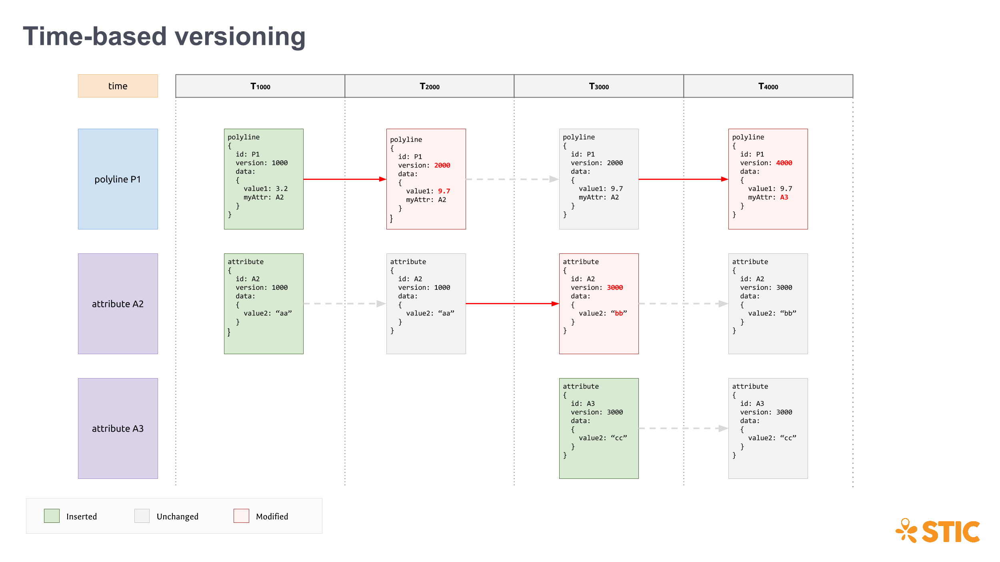

Implementing versioning of unrelated objects is relatively easy. This can be achieved via simple integer-based versioning:

    { object_id: 23, version_id: 1 }

or through id-based versioning:

    { object_id: C01A42D4, version_id: A744B23E2 }

In either case, the difficulty is often ensuring optimistic concurrency with the underlying data store (more on this in [Optimistic concurrency in Mongo](index.md).

However, when the data is related, the problem becomes much more difficult. One issue we had with a simple integer-based or id-based approach was the need to "bubble up" version changes through all connections. In a graph, this means every reachable object must be updated in order to ensure that we have a correct "snapshot" of that point in time. Otherwise, it becomes impossible to know the state of connections at a certain point in time.

This is where time-based versioning comes in. Instead of versioning entities and relationships with arbitrary numbers or identifiers, they are versioned based on time.

If the relationships are stored externally, such as in a graph database, then the relationships themselves are separately versioned with time. Here, we have two types of nodes and two types of edges. Identity nodes represent object identity only. State nodes hold state value. State relationships connect identity nodes to their corresponding state nodes at different time-based versions. Structural relationships connect identity nodes to each other, forming parent-child relationships, foreign-key relationships, etc. Structural relationships are also versioned based on time, just as the state relationships are. With these concepts in place, it is possible to see the entire state of a set of objects and relationships at a given point in time.

If the entities are represented with documents that contain relationships, these relationships are then also intrinsically versioned based on the version time of the entity. It is key that, inside the documents, relationships only reference other objects' identities, and not their versions. This aligns with the approach in the graph database where structural relationships only connect identity nodes, not specific state nodes.

For further reading check out <http://iansrobinson.com/2014/05/13/time-based-versioned-graphs/>.