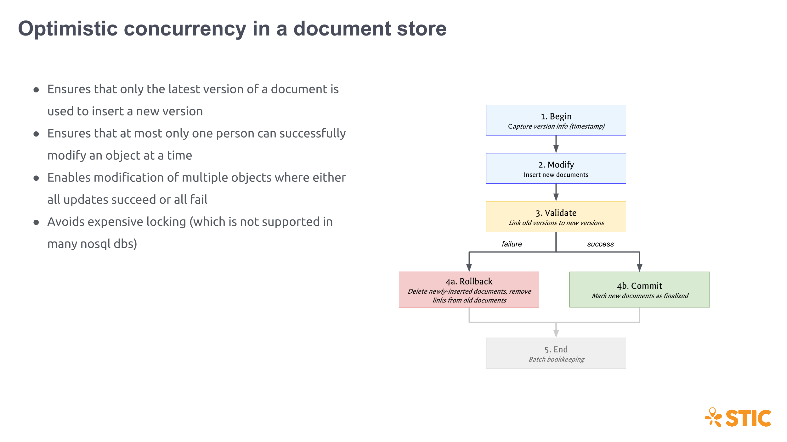

MongoDB does not support traditional "transactions" as we think of them in the RDBMS world. It supports [ACID](https://en.wikipedia.org/wiki/ACID) transactions only within a single document. However, we can use [optimistic concurrency control (OCC)](https://en.wikipedia.org/wiki/Optimistic_concurrency_control) to ensure proper version updating in Mongo, despite this lack of cross-document transaction support.

**The first and most important point is that everything we create is immutable.** This means that there is no true "update". An update of a document is, in actuality, creating a new document with a new version.



An update starts by capturing the current time (the *Begin* phase of OCC). This will be used in subsequent steps. That time is assigned to the new document, and that document is inserted (the *Modify* phase of OCC). Remember that we are using [time-based versioning](./), so the version ids are, in fact, timestamps.

```c#
// Capture the time
var now = DateTime.UtcNow;

// Set the version info and insert the new document
var currentVersion = polylineSet.Id.VersionId;

polylineSet.Id.VersionId = now.Ticks;
polylineSet.TrackingInfo.IsFinalized = false;
polylineSet.TrackingInfo.NextVersionId = UnsetVersionIdValue;

var collection = GetPolylineSetCollection();
await collection.InsertOneAsync(polylineSet);
```

Once the document is inserted, we must perform the *Validate* phase of OCC, where we ensure that no one else has modified the same data. To do this, we use an atomic [test-and-set](https://en.wikipedia.org/wiki/Test-and-set) in Mongo using our `NextVersionId` property:

```c#
// Try to link from the previous version (could fail)
var filter = Builders<PolylineSet>.Filter.Eq("Id", new VersionedId { ObjectId = polylineSet.Id.ObjectId, VersionId = currentVersion }) & Builders<PolylineSet>.Filter.Eq("TrackingInfo.NextVersionId", UnsetVersionIdValue);

if (!updateDeleted) filter &= Builders<PolylineSet>.Filter.Eq("TrackingInfo.IsDeleted", false);

var update = Builders<PolylineSet>.Update.Set("TrackingInfo.NextVersionId", polylineSet.Id.VersionId);
var updateResult = await collection.UpdateOneAsync(filter, update);
```

This step could fail if someone else has already performed the same atomic test-and-set to their inserted version. If so, we must perform the *Rollback* phase of OCC by deleting our newly-inserted document. It would also be polite to return something useful to the client, such as what the "head" version of the document is so that they can update to it and then re-attempt their changes.

If, however, we succeed, then that means our new version "won" over any competing changes. We finish OCC by executing the *Commit* phase. Here, we mark the newly document as "finalized" so that it will be returned in query results. Note that, up to now, only the "previous" finalized version of the document would be returned in any query results.

```c#
// If the link succeeds, finalize the inserted document
filter = Builders<PolylineSet>.Filter.Eq("Id", polylineSet.Id);
update = Builders<PolylineSet>.Update.Set("TrackingInfo.IsFinalized", true);
updateResult = await collection.UpdateOneAsync(filter, update);
```

With that, the update to the new version is complete.

While we don't support multi-update "transactions" in artemis, we do support batch updates — ensuring that either all updates succeed or none do. To accomplish this, we follow the same phases laid out above for all updates in the batch. If at any point in a phase we encounter a failure (most likely indicating someone else's changes beat us), we undo all changes performed so far.the CircleCI-specific script (`circle.yml`) has only a handful of lines in it, thus making our CI build more easily portable to another provider, if needed. Additionally, the same setup as used in the CI build can be deployed and run locally with exactly the same results.